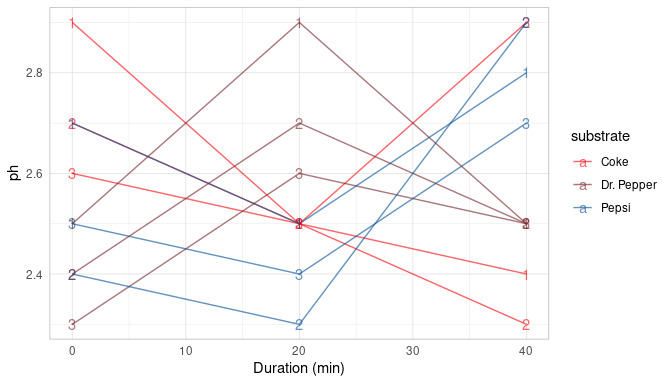

This report covers the analyses used in the ZZZ project (Marcus Mark, PI).

<!--  Set the working directory to the repository's base directory; this assumes the report is nested inside of two directories.-->


<!-- Set the report-wide options, and point to the external code file. -->


<!-- Load 'sourced' R files.  Suppress the output when loading sources. -->


<!-- Load packages, or at least verify they're available on the local machine.  Suppress the output when loading packages. -->


<!-- Load any global functions and variables declared in the R file.  Suppress the output. -->


<!-- Declare any global functions specific to a Rmd output.  Suppress the output. -->


<!-- Load the datasets.   -->


<!-- Tweak the datasets.   -->


Summary {.tabset .tabset-fade .tabset-pills}
===========================================================================

Notes
---------------------------------------------------------------------------

1. The current report covers 51 sampling points, with 3 unique values for `substrate` and 9 cans.


Unanswered Questions
---------------------------------------------------------------------------

Answered Questions
---------------------------------------------------------------------------


Graphs
===========================================================================


Marginals
---------------------------------------------------------------------------


Spaghetti Plots
---------------------------------------------------------------------------

<!-- -->


Models
===========================================================================

Model Exploration
---------------------------------------------------------------------------


Final Model
---------------------------------------------------------------------------


In the model that includes two predictors, the slope coefficent of `Miles per gallon` is r summary(m2)$coefficients[2,1].


Session Information {#session-info}
===========================================================================

For the sake of documentation and reproducibility, the current report was rendered in the following environment.  Click the line below to expand.

<details>
  <summary>Environment <span class="glyphicon glyphicon-plus-sign"></span></summary>

```
─ Session info ───────────────────────────────────────────────────────────────
 setting  value                       
 version  R version 4.0.3 (2020-10-10)
 os       Ubuntu 20.10                
 system   x86_64, linux-gnu           
 ui       X11                         
 language (EN)                        
 collate  en_US.UTF-8                 
 ctype    en_US.UTF-8                 
 tz       America/Chicago             
 date     2021-02-18                  

─ Packages ───────────────────────────────────────────────────────────────────
 package     * version date       lib source        
 assertthat    0.2.1   2019-03-21 [1] CRAN (R 4.0.0)
 callr         3.5.1   2020-10-13 [1] CRAN (R 4.0.3)
 cli           2.3.0   2021-01-31 [1] CRAN (R 4.0.3)
 colorspace    2.0-0   2020-11-11 [1] CRAN (R 4.0.3)
 crayon        1.4.1   2021-02-08 [1] CRAN (R 4.0.3)
 desc          1.2.0   2018-05-01 [1] CRAN (R 4.0.0)
 devtools      2.3.2   2020-09-18 [1] CRAN (R 4.0.2)
 digest        0.6.27  2020-10-24 [1] CRAN (R 4.0.3)
 dplyr         1.0.2   2020-08-18 [1] CRAN (R 4.0.2)
 ellipsis      0.3.1   2020-05-15 [1] CRAN (R 4.0.0)
 evaluate      0.14    2019-05-28 [1] CRAN (R 4.0.0)
 farver        2.0.3   2020-01-16 [1] CRAN (R 4.0.0)
 fs            1.5.0   2020-07-31 [1] CRAN (R 4.0.2)
 generics      0.1.0   2020-10-31 [1] CRAN (R 4.0.3)
 ggplot2     * 3.3.2   2020-06-19 [1] CRAN (R 4.0.1)
 glue          1.4.2   2020-08-27 [1] CRAN (R 4.0.2)
 gtable        0.3.0   2019-03-25 [1] CRAN (R 4.0.0)
 highr         0.8     2019-03-20 [1] CRAN (R 4.0.0)
 hms           1.0.0   2021-01-13 [1] CRAN (R 4.0.3)
 htmltools     0.5.1.1 2021-01-22 [1] CRAN (R 4.0.3)
 import        1.2.0   2020-09-24 [1] CRAN (R 4.0.2)
 knitr       * 1.31    2021-01-27 [1] CRAN (R 4.0.3)
 labeling      0.4.2   2020-10-20 [1] CRAN (R 4.0.3)
 lifecycle     0.2.0   2020-03-06 [1] CRAN (R 4.0.0)
 magrittr      2.0.1   2020-11-17 [1] CRAN (R 4.0.3)
 memoise       1.1.0   2017-04-21 [1] CRAN (R 4.0.0)
 munsell       0.5.0   2018-06-12 [1] CRAN (R 4.0.0)
 pillar        1.4.6   2020-07-10 [1] CRAN (R 4.0.2)
 pkgbuild      1.2.0   2020-12-15 [1] CRAN (R 4.0.3)
 pkgconfig     2.0.3   2019-09-22 [1] CRAN (R 4.0.0)
 pkgload       1.1.0   2020-05-29 [1] CRAN (R 4.0.0)
 prettyunits   1.1.1   2020-01-24 [1] CRAN (R 4.0.0)
 processx      3.4.5   2020-11-30 [1] CRAN (R 4.0.3)
 ps            1.5.0   2020-12-05 [1] CRAN (R 4.0.3)
 purrr         0.3.4   2020-04-17 [1] CRAN (R 4.0.0)
 R6            2.5.0   2020-10-28 [1] CRAN (R 4.0.3)
 readr         1.4.0   2020-10-05 [1] CRAN (R 4.0.3)
 remotes       2.2.0   2020-07-21 [1] CRAN (R 4.0.2)
 rlang         0.4.10  2020-12-30 [1] CRAN (R 4.0.3)
 rmarkdown     2.5     2020-10-21 [1] CRAN (R 4.0.3)
 rprojroot     2.0.2   2020-11-15 [1] CRAN (R 4.0.3)
 scales        1.1.1   2020-05-11 [1] CRAN (R 4.0.0)
 sessioninfo   1.1.1   2018-11-05 [1] CRAN (R 4.0.0)
 stringi       1.5.3   2020-09-09 [1] CRAN (R 4.0.2)
 stringr       1.4.0   2019-02-10 [1] CRAN (R 4.0.0)
 testthat      3.0.0   2020-10-31 [1] CRAN (R 4.0.3)
 tibble        3.0.4   2020-10-12 [1] CRAN (R 4.0.3)
 tidyselect    1.1.0   2020-05-11 [1] CRAN (R 4.0.0)
 usethis       1.6.3   2020-09-17 [1] CRAN (R 4.0.2)
 vctrs         0.3.6   2020-12-17 [1] CRAN (R 4.0.3)
 withr         2.4.1   2021-01-26 [1] CRAN (R 4.0.3)
 xfun          0.21    2021-02-10 [1] CRAN (R 4.0.3)
 yaml          2.2.1   2020-02-01 [1] CRAN (R 4.0.0)

[1] /home/wibeasley/R/x86_64-pc-linux-gnu-library/4.0
[2] /usr/local/lib/R/site-library
[3] /usr/lib/R/site-library
[4] /usr/lib/R/library
```
</details>


Report rendered by wibeasley at 2021-02-18, 21:14 -0600 in 1 seconds.
