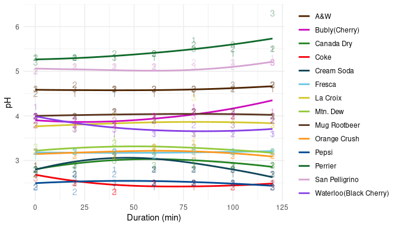
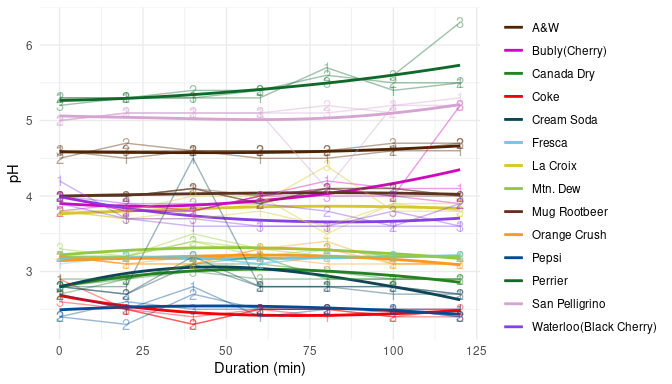
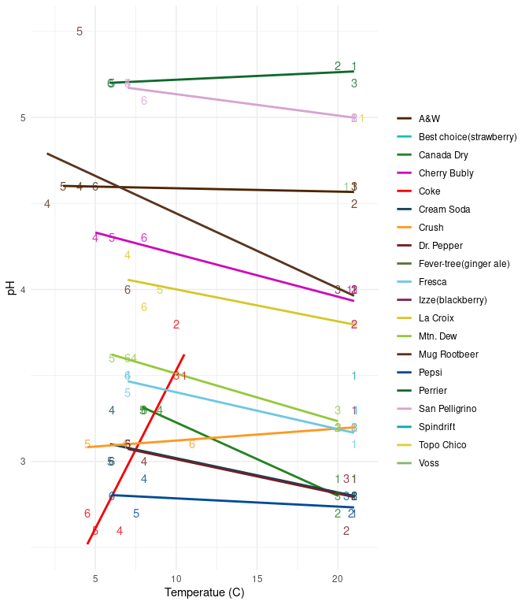
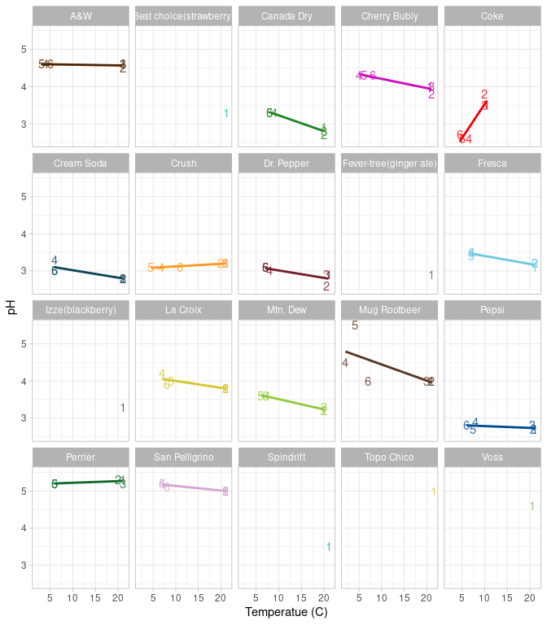

This report covers the analyses usedby Maya & Valencia.

<!--  Set the working directory to the repository's base directory; this assumes the report is nested inside of two directories.-->


<!-- Set the report-wide options, and point to the external code file. -->


<!-- Load 'sourced' R files.  Suppress the output when loading sources. -->


<!-- Load packages, or at least verify they're available on the local machine.  Suppress the output when loading packages. -->


<!-- Load any global functions and variables declared in the R file.  Suppress the output. -->


<!-- Declare any global functions specific to a Rmd output.  Suppress the output. -->


<!-- Load the datasets.   -->


<!-- Tweak the datasets.   -->


Summary {.tabset .tabset-fade .tabset-pills}
===========================================================================

Notes
---------------------------------------------------------------------------

1. Maya's current report covers 42 sampling points, with 2 unique values for `substrate` and 6 cans.

1. Valencia's current report covers 90 sampling points, with 20 unique values for `substrate` and 90 cans.


Unanswered Questions
---------------------------------------------------------------------------

Answered Questions
---------------------------------------------------------------------------


Graphs
===========================================================================


Marginals
---------------------------------------------------------------------------


Spaghetti Plots - Maya
---------------------------------------------------------------------------
The first plot contains 6 faint spaghetti strands, each representing a single can's longitudinal trajectory.  Each substrate is assigned a distinct color.  Each substrate has three independent cans, indicated by the plotted digits 1, 2, 3.  Each substrate is summarized by a thick [loess](https://en.wikipedia.org/wiki/Local_regression) curve to capture any nonlinear trend.

The second plot is faceted to better inspect patterns within substrate.

<!-- --><!-- -->

Scatter Plots - Valencia
---------------------------------------------------------------------------
The first plot contains 90 one [regression](https://en.wikipedia.org/wiki/General_linear_model) per substrate, each summarizing the substrate's linear relationship between temperature and pH.  Each substrate is assigned a distinct color and has six independent cans, indicated by the plotted digits 1, 2, ..., 6.

The second plot is faceted to better inspect patterns within substrate.

<!-- --><!-- -->


Models
===========================================================================

Model Exploration
---------------------------------------------------------------------------


Final Model
---------------------------------------------------------------------------


In the model that includes two predictors, the slope coefficent of `Miles per gallon` is r summary(m2)$coefficients[2,1].


Session Information {#session-info}
===========================================================================

For the sake of documentation and reproducibility, the current report was rendered in the following environment.  Click the line below to expand.

<details>
  <summary>Environment <span class="glyphicon glyphicon-plus-sign"></span></summary>

```
─ Session info ───────────────────────────────────────────────────────────────
 setting  value                       
 version  R version 4.0.3 (2020-10-10)
 os       Ubuntu 20.10                
 system   x86_64, linux-gnu           
 ui       X11                         
 language (EN)                        
 collate  en_US.UTF-8                 
 ctype    en_US.UTF-8                 
 tz       America/Chicago             
 date     2021-03-15                  

─ Packages ───────────────────────────────────────────────────────────────────
 package     * version    date       lib source                       
 assertthat    0.2.1      2019-03-21 [1] CRAN (R 4.0.0)               
 bslib         0.2.4      2021-01-25 [1] CRAN (R 4.0.3)               
 cachem        1.0.4      2021-02-13 [1] CRAN (R 4.0.3)               
 callr         3.5.1      2020-10-13 [1] CRAN (R 4.0.3)               
 cli           2.3.1      2021-02-23 [1] CRAN (R 4.0.3)               
 colorspace    2.0-0      2020-11-11 [1] CRAN (R 4.0.3)               
 crayon        1.4.1      2021-02-08 [1] CRAN (R 4.0.3)               
 DBI           1.1.1      2021-01-15 [1] CRAN (R 4.0.3)               
 debugme       1.1.0      2017-10-22 [1] CRAN (R 4.0.0)               
 desc          1.2.0      2018-05-01 [1] CRAN (R 4.0.0)               
 devtools      2.3.2      2020-09-18 [1] CRAN (R 4.0.2)               
 digest        0.6.27     2020-10-24 [1] CRAN (R 4.0.3)               
 dplyr         1.0.4      2021-02-02 [1] CRAN (R 4.0.3)               
 ellipsis      0.3.1      2020-05-15 [1] CRAN (R 4.0.0)               
 evaluate      0.14       2019-05-28 [1] CRAN (R 4.0.0)               
 fansi         0.4.2      2021-01-15 [1] CRAN (R 4.0.3)               
 farver        2.1.0      2021-02-28 [1] CRAN (R 4.0.3)               
 fastmap       1.1.0      2021-01-25 [1] CRAN (R 4.0.3)               
 fs            1.5.0      2020-07-31 [1] CRAN (R 4.0.2)               
 generics      0.1.0      2020-10-31 [1] CRAN (R 4.0.3)               
 ggplot2     * 3.3.3      2020-12-30 [1] CRAN (R 4.0.3)               
 glue          1.4.2      2020-08-27 [1] CRAN (R 4.0.2)               
 gtable        0.3.0      2019-03-25 [1] CRAN (R 4.0.0)               
 highr         0.8        2019-03-20 [1] CRAN (R 4.0.0)               
 hms           1.0.0      2021-01-13 [1] CRAN (R 4.0.3)               
 htmltools     0.5.1.1    2021-01-22 [1] CRAN (R 4.0.3)               
 import        1.2.0      2020-09-24 [1] CRAN (R 4.0.2)               
 jquerylib     0.1.3      2020-12-17 [1] CRAN (R 4.0.3)               
 jsonlite      1.7.2      2020-12-09 [1] CRAN (R 4.0.3)               
 knitr       * 1.31       2021-01-27 [1] CRAN (R 4.0.3)               
 labeling      0.4.2      2020-10-20 [1] CRAN (R 4.0.3)               
 lattice       0.20-41    2020-04-02 [4] CRAN (R 4.0.0)               
 lifecycle     1.0.0      2021-02-15 [1] CRAN (R 4.0.3)               
 magrittr      2.0.1      2020-11-17 [1] CRAN (R 4.0.3)               
 Matrix        1.2-18     2019-11-27 [4] CRAN (R 4.0.0)               
 memoise       2.0.0      2021-01-26 [1] CRAN (R 4.0.3)               
 mgcv          1.8-33     2020-08-27 [4] CRAN (R 4.0.2)               
 munsell       0.5.0      2018-06-12 [1] CRAN (R 4.0.0)               
 nlme          3.1-152    2021-02-04 [1] CRAN (R 4.0.3)               
 pillar        1.5.0.9000 2021-02-23 [1] Github (r-lib/pillar@dc5916a)
 pkgbuild      1.2.0      2020-12-15 [1] CRAN (R 4.0.3)               
 pkgconfig     2.0.3      2019-09-22 [1] CRAN (R 4.0.0)               
 pkgload       1.2.0      2021-02-23 [1] CRAN (R 4.0.3)               
 prettyunits   1.1.1      2020-01-24 [1] CRAN (R 4.0.0)               
 processx      3.4.5      2020-11-30 [1] CRAN (R 4.0.3)               
 ps            1.6.0      2021-02-28 [1] CRAN (R 4.0.3)               
 purrr         0.3.4      2020-04-17 [1] CRAN (R 4.0.0)               
 R6            2.5.0      2020-10-28 [1] CRAN (R 4.0.3)               
 readr         1.4.0      2020-10-05 [1] CRAN (R 4.0.3)               
 remotes       2.2.0      2020-07-21 [1] CRAN (R 4.0.2)               
 rlang         0.4.10     2020-12-30 [1] CRAN (R 4.0.3)               
 rmarkdown     2.7        2021-02-19 [1] CRAN (R 4.0.3)               
 rprojroot     2.0.2      2020-11-15 [1] CRAN (R 4.0.3)               
 sass          0.3.1      2021-01-24 [1] CRAN (R 4.0.3)               
 scales        1.1.1      2020-05-11 [1] CRAN (R 4.0.0)               
 sessioninfo   1.1.1      2018-11-05 [1] CRAN (R 4.0.0)               
 stringi       1.5.3      2020-09-09 [1] CRAN (R 4.0.2)               
 stringr       1.4.0      2019-02-10 [1] CRAN (R 4.0.0)               
 testthat      3.0.2      2021-02-14 [1] CRAN (R 4.0.3)               
 tibble        3.1.0      2021-02-25 [1] CRAN (R 4.0.3)               
 tidyselect    1.1.0      2020-05-11 [1] CRAN (R 4.0.0)               
 usethis       2.0.1      2021-02-10 [1] CRAN (R 4.0.3)               
 utf8          1.1.4      2018-05-24 [1] CRAN (R 4.0.0)               
 vctrs         0.3.6      2020-12-17 [1] CRAN (R 4.0.3)               
 withr         2.4.1      2021-01-26 [1] CRAN (R 4.0.3)               
 xfun          0.21       2021-02-10 [1] CRAN (R 4.0.3)               
 yaml          2.2.1      2020-02-01 [1] CRAN (R 4.0.0)               

[1] /home/wibeasley/R/x86_64-pc-linux-gnu-library/4.0
[2] /usr/local/lib/R/site-library
[3] /usr/lib/R/site-library
[4] /usr/lib/R/library
```
</details>


Report rendered by wibeasley at 2021-03-15, 23:12 -0500 in 5 seconds.
